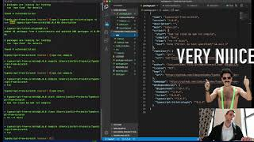

# TypeScript-From-Scratch

This is the source code from the Youtube video: https://youtu.be/igEqkiqDqf0

<a href="https://youtu.be/igEqkiqDqf0">
  
</a>

# Usage

- Install dependencies:
```
npm i
```

- Compile TypeScript src files to javascript in the `dist/` directory and run those node files.  
```
npm start
```

- Run "start" in watch mode (re-compiles and re-runs automatically when the source code or tests change).
```
npm run start:watch
```

- Run Jest unit tests.
```
npm test
```

- Run "test" in watch mode (re-compiles and re-runs automatically when the source code or tests change).
```
npm run start:watch
```

- Run tslint with the --fix flag.
```
npm run lint
```

